### **블록체인(Ethereum)을 활용한 오픈마켓 플랫폼(DAPP)**

------

#### **1. 프로젝트 설명**

기존 오픈마켓에서 은행, 공공기관 등 제 3자가 개입되어 거래를 진행하던 결제 시스템 구조(ex: 에스크로)를 이더리움 블록체인의 스마트 컨트랙트(Smart Contract)를 활용해 자동화한 플랫폼 입니다. 

 

#### **2. 개발 목표**

오픈마켓은 온라인 상에서 판매자 개인이나 소규모 업체가 직접 물건을 등록하고 구매자가 해당 물건을 구입하는 플랫폼으로, 중간유통 과정이 생략된 C2C(Customer to Customer) 구조를 가지고 있습니다.

 

이에 따라 다음과 같은 피해가 발생하였습니다.

1. 오픈마켓 상에서 가짜 사이트로 결제를 유도하는 등의 사기가 빈번히 발생하며 많은 피해를 주었습니다.
2. 판매자의 쉬운 가입 및 등록절차로 인해 소비자가 신뢰할 수 없는 물건을 구매하는 피해가 있었습니다.

 

이러한 문제의 해결을 위해 다음 두 가지를 목표로 잡고 프로젝트 개발을 진행했습니다.

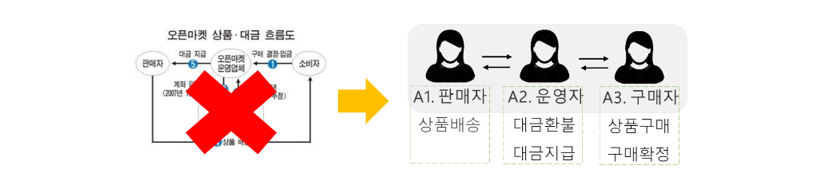

1. 판매자와 구매자 간 제 3자 개입없이 거래를 자동화한 플랫폼
2. 블록체인 상에 구매내역을 영구히 저장하여 법적 효력 발생

  

### **시작하기(Getting Started)**

------

#### **1. 개발환경**

 

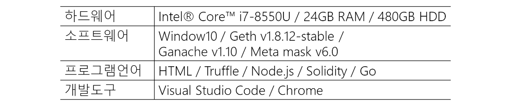

 

(1) Geth(GoEthereum): 테스트용 이더리움 블록체인(Private)에 접속할 수 있도록 도와줍니다.

(2) Ganache: 이더리움 블록체인을 구성하는 클라이언트(Client)역할을 합니다.

(3) MetaMask: 이더(Eth, Ether)를 확인하는 지갑입니다.

(4) Truffle: 이더리움 블록체인 상에 스마트 컨트랙트(Smart Contract)를 배포하도록 합니다.

(5) Solidity: 스마트 컨트랙트(Smart Contract)를 구성하는 언어입니다.

(6) Go: 이더리움 블록체인 네트워크를 구성하는 언어입니다.

(7) Frontend: Html5, Javascript, CSS / Backend: Node.js(HTTP 통신-Express.js) / Debug: Chrome / Editor: VSC

 

#### **2. 설치(Installation)**

1. ##### **이더리움 DAPP 환경설정(PowerShell)**

   (1) Geth: https://geth.ethereum.org/downloads/

   (2) Ganache: https://www.trufflesuite.com/ganache

   (3) Node.js: https://nodejs.org/en/download/

   (4) Truffle: https://www.trufflesuite.com/

   (5) VSC(Visual Studio Code): https://code.visualstudio.com/

   (6) Metamask(Chrome): https://metamask.io/download.html 

    

2. ##### **Geth로 Private Node 구축**

   <u>▶ On Windows10(Local)</u> : https://m.blog.naver.com/PostView.nhn?blogId=yoo37450&logNo=221196503550&proxyReferer=https:%2F%2Fwww.google.com%2F 

   ▶ On Ubuntu: https://gongple.tistory.com/8

   ▶ Multi Node Private Network(Ubuntu): https://developer-mac.tistory.com/44

    

   (1) Genesis Block 생성: 블록체인을 구성하는 첫 번째 블록을 의미합니다.

   (2) 계정 생성: 블록체인에서 거래를 진행하고 채굴(블록 생성)할 계정을 생성합니다.

   (3) 노드 첫 실행: Genesis Block을 통해 첫 블록체인 네트워크를 구동합니다.

   (4) DAG 파일 생성: 채굴이 시작되면 해당 내용을 알리는 파일입니다.

   => [https://medium.com/returnvalues/docker%EB%A1%9C-%EC%9D%B4%EB%8D%94%EB%A6%AC%EC%9B%80-%EB%84%A4%ED%8A%B8%EC%9B%8C%ED%81%AC-%EA%B5%AC%EC%B6%95%ED%95%98%EA%B8%B0-5735b48ea43f](https://medium.com/returnvalues/docker로-이더리움-네트워크-구축하기-5735b48ea43f)

   

### **개발하기**

------

#### **1. 시스템 구성도**

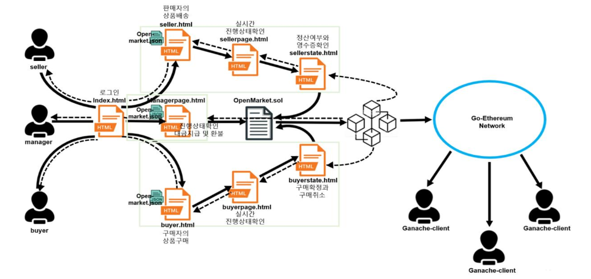

(1) OpenMarket.sol : 오픈마켓 상에서 일어나는 거래를 자동화하는 스마트 컨트랙트입니다. Geth로 네트워크 구축 후 Truffle을 통해 가장 먼저 배포해줍니다.

▶ 판매자가 구매를 누를 시 은행, 공공기관 등을 거치지 않고 운영자에게 대금이 지급되며 운영자는 지급버튼을 눌러 구매자에게 최종 대금을 전달합니다.

▶ 오픈마켓 상의 물건 데이터(이름, 판매자, 가격 등)는 Open-Market.json을 사용해 구축했습니다.

(2) Index.html: 판매자(seller), 운영자(manager), 구매자(buyer)가 가장 처음으로 접속하는 화면입니다.

(3) seller.html ▶ sellerpage.html ▶ sellerstate.html: 판매자가 구매자의 거래내역을 실시간으로 확인(seller.html)하고, 배송버튼(sellerpage.html)을 누르며 구매확정/환불 상태를 확인(sellerstate.html)합니다.

(4) Managerpage.html: 운영자가 구매자의 대금을 판매자에게 전달하고 거래 및 정산현황을 확인합니다.

(5) buyer.html ▶ buyerpage.html ▶ buyerstate.html: 구매자가 물건을 구매(buyer.html)하고 배송상태를 확인(buyerpage.html)하며, 구매확정/환불을 진행(buyerstate.html)하는 페이지 흐름입니다.

 

#### 2. 사용예제

▶ ethereum_project_2019/발표자료/201502085_유정현(20190625).pdf 참고

1. ##### **Index.html(첫 접속페이지)**

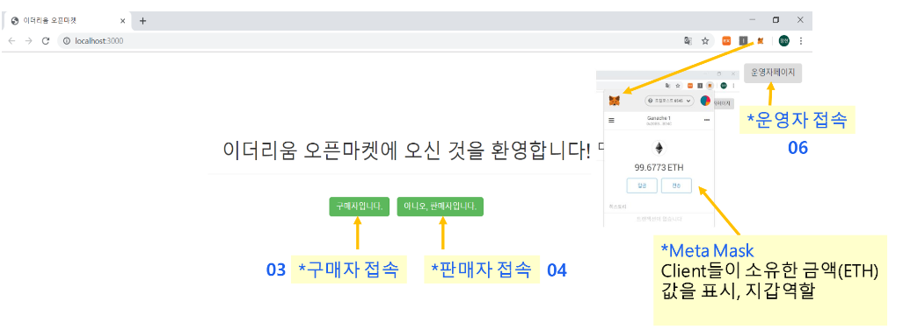

 

2. ##### **seller.html(판매자 페이지)**

   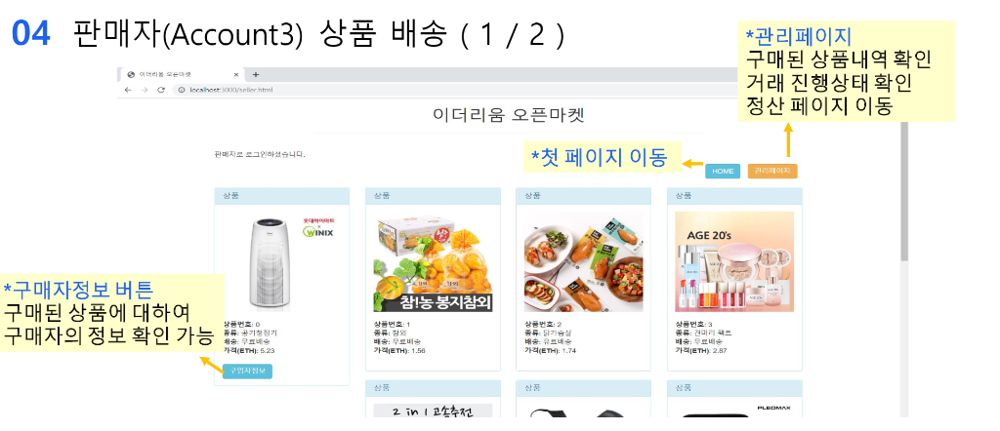

    
   
   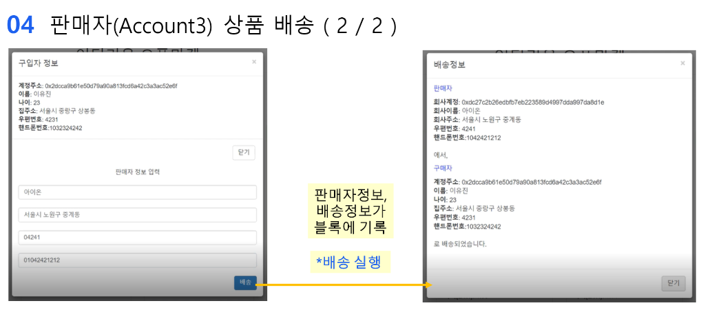

 

3. ##### **ManagerPage.html(운영자 페이지)**

   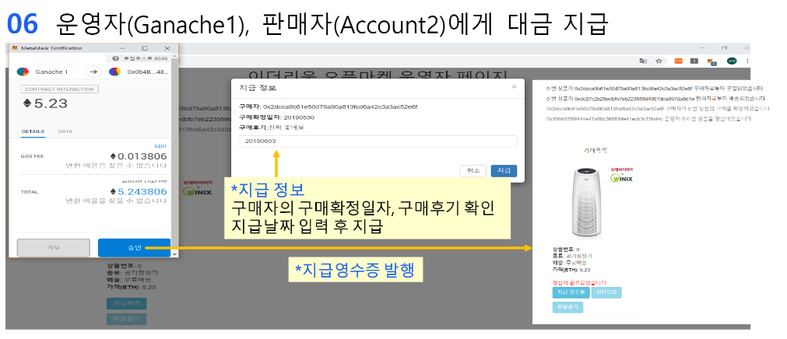

 

4. ##### buyer.html(구매자 페이지)

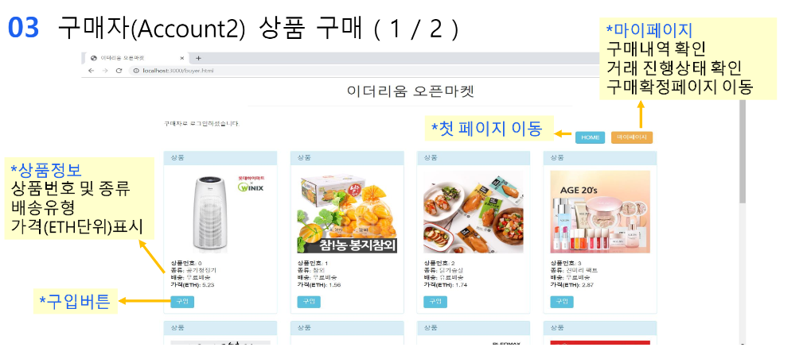

 

   

### 추가연구

------

▶Virtualbox에서 Ubuntu 환경의 Multi Node Private Network(구축: README.md>시작하기>2.설치>2.Geth로 Private Node 구축 참고) 구축하여 거래 및 채굴을 진행하였습니다.

 

#### **1. 환경설정**

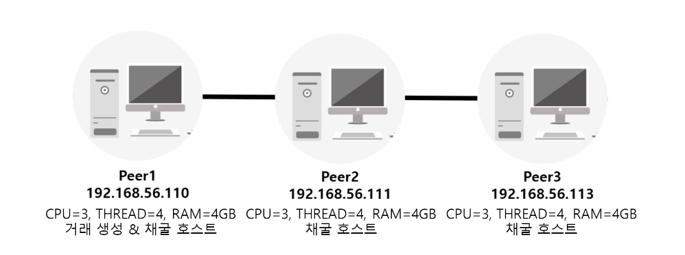

 

#### 2. 결론

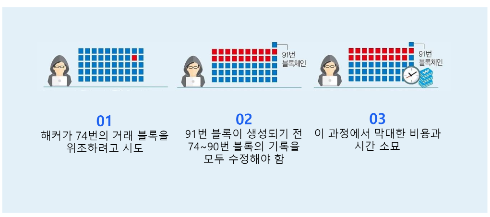

 

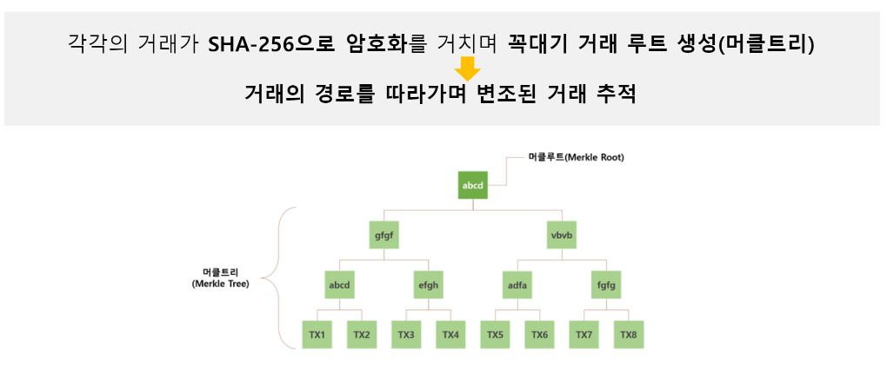

 

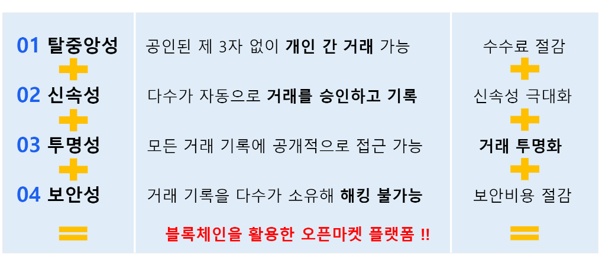

 